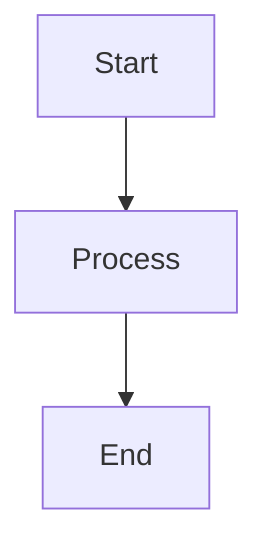
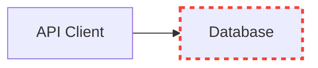

# AutoFlow Graph Visualization Guide

## Overview

AutoFlow now includes **comprehensive graph visualization** capabilities:

✅ **Mermaid diagram generation** from context graphs
✅ **Issue highlighting** (red dashed borders)
✅ **Proposal highlighting** (green thick borders)
✅ **Before/after comparisons**
✅ **Custom styling** (color schemes, layouts)
✅ **Notification integration** (automatic visualizations in alerts)
✅ **Multiple export formats** (Mermaid, Markdown, PNG)

## 🎯 Quick Start

### Basic Visualization

```python
from autoflow.viz.mermaid import visualize_context_graph
from autoflow.types_pyantic import GraphNode, GraphEdge

# Your graph data
nodes = [GraphNode(node_id="main.py", node_type="file", properties={...})]
edges = [GraphEdge(edge_type="calls", from_node_id="main", to_node_id="fetch")]

# Generate visualization
viz = visualize_context_graph(nodes, edges)

# Print as Markdown (ready for GitHub/GitLab)
print(viz.to_markdown())

# Or save to file
viz.save("my_graph.mmd")
```

### Visualization with Issues

```python
# Highlight problematic nodes
issue_nodes = {"fetch_data", "database"}

viz = visualize_context_graph(
    nodes,
    edges,
    issue_node_ids=issue_nodes,
)

print(viz.to_markdown())
# Problematic nodes will have red dashed borders
```

### Visualization with Proposals

```python
from autoflow.types import ChangeProposal, ProposalKind, RiskLevel

proposal = ChangeProposal(
    kind=ProposalKind.CONFIG_EDIT,
    title="Add retry logic",
    risk=RiskLevel.LOW,
    target_paths=["fetch_data"],
    payload={...},
)

viz = visualize_context_graph(
    nodes,
    edges,
    proposals=[proposal],
)

print(viz.to_markdown())
# Affected nodes will have green thick borders
```

### Before/After Visualization

```python
from autoflow.viz.mermaid import visualize_proposals

proposals = [proposal1, proposal2]

visualizations = visualize_proposals(nodes, edges, proposals)

# Three views:
visualizations["before"].to_markdown()  # Current state
visualizations["after"].to_markdown()   # With changes highlighted
visualizations["diff"].to_markdown()    # Only affected nodes
```

## 📊 Viewing Mermaid Diagrams

### Option 1: GitHub/GitLab (Native Support)

Simply paste the Mermaid diagram in a Markdown file:

```markdown
# My Graph Analysis


```

GitHub and GitLab will automatically render it!

### Option 2: Mermaid Live Editor

1. Go to https://mermaid.live
2. Paste your Mermaid code
3. See real-time preview
4. Export to PNG/SVG

### Option 3: VS Code Extension

1. Install "Mermaid Preview" extension
2. Open a `.md` or `.mmd` file
3. Press `Cmd+Shift+V` to preview

### Option 4: Command Line

```bash
# Install mermaid-cli
npm install -g @mermaid-js/mermaid-cli

# Render to PNG
mmdc -i graph.mmd -o graph.png

# Render to SVG
mmdc -i graph.mmd -o graph.svg
```

## 🎨 Styling Options

### Color Schemes

```python
from autoflow.viz.mermaid import VisualizationConfig, visualize_context_graph

# Default (professional colors)
config = VisualizationConfig(color_scheme="default")

# Muted (subtle, low contrast)
config = VisualizationConfig(color_scheme="muted")

# Vibrant (high contrast, colorful)
config = VisualizationConfig(color_scheme="vibrant")

viz = visualize_context_graph(nodes, edges, **config.__dict__)
```

### Layout Direction

```python
# Top-to-Bottom (default)
config = VisualizationConfig(layout_direction="TB")

# Left-to-Right
config = VisualizationConfig(layout_direction="LR")

# Right-to-Left
config = VisualizationConfig(layout_direction="RL")

# Bottom-to-Top
config = VisualizationConfig(layout_direction="TD")
```

### Node Grouping

```python
# Group nodes by type (files, functions, classes, etc.)
config = VisualizationConfig(group_by_type=True)
```

### Content Filtering

```python
# Limit nodes for readability
config = VisualizationConfig(max_nodes=50)

# Only show specific node types
config = VisualizationConfig(node_types={"file", "function"})

# Exclude nodes matching patterns
config = VisualizationConfig(exclude_patterns=["test_.*", ".*_test\\.py"])
```

## 🔔 Integration with Notifications

### Console Notifications with Visualizations

```python
from autoflow.notifications import autoflow_manual_review

workflow = autoflow_manual_review(
    notify="console",
    # Enable visualizations in console output
    include_visualizations=True,
)

# When proposals are generated, the console output will include:
# - Proposal details
# - Context information
# - Mermaid diagram showing the graph with highlights
await workflow.propose(proposals, context={
    "graph_nodes": nodes,
    "graph_edges": edges,
    "triggering_events": events,
})
```

### File Notifications with Visualizations

```python
from autoflow.notifications import autoflow_manual_review

workflow = autoflow_manual_review(
    notify="file",
    notification_config={
        "output_path": "proposals.md",
        "format": "markdown",
        "include_visualizations": True,
        "visualization_dir": "autoflow_viz",
    },
)

# This will:
# 1. Write proposals to proposals.md
# 2. Save Mermaid diagrams to autoflow_viz/ directory
# 3. Link them in the markdown file
await workflow.propose(proposals, context)
```

## 🎨 Visual Elements

### Node Styling

| Node Type | Style | Color |
|-----------|-------|-------|
| **File** | Blue border, light blue fill | `#ebf3ff` / `#2196f3` |
| **Function** | Green border, light green fill | `#e8f5e9` / `#4caf50` |
| **Class** | Purple border, light purple fill | `#f3e5f5` / `#9c27b0` |
| **Decision** | Orange border, light orange fill | `#fff3e0` / `#ff9800` |
| **Issue** | 🔴 Red dashed border (3px) | `#ffebee` / `#f44336` |
| **Proposal** | 🟢 Green thick border (3px) | `#e0f2f1` / `#009688` |
| **Default** | Gray border, light gray fill | `#e1e5e9` / `#363636` |

### Edge Styling

| Edge Type | Arrow Style |
|-----------|-------------|
| **calls** | `-->` (solid arrow) |
| **imports** | `-.->` (dotted arrow) |
| **defines** | `==>` (thick arrow) |
| **uses** | `-->` (solid arrow) |
| **related_to** | `-...-` (dotted line) |
| **context_for** | `----` (line) |

## 📚 Complete Example

```python
import asyncio
from autoflow.factory import autoflow
from autoflow.viz.mermaid import visualize_proposals
from autoflow.types import ChangeProposal, ProposalKind, RiskLevel
from autoflow.types_pyantic import GraphNode, GraphEdge

async def main():
    # 1. Create AutoFlow engine
    engine = autoflow(in_memory=True)

    # 2. Generate some context
    events = [
        {"source": "api", "name": "timeout"},
        {"source": "api", "name": "timeout"},
    ]

    await engine.ingest(events)

    # 3. Query for proposals
    proposals = await engine.propose()

    # 4. Get graph context
    nodes = await engine.store.query_nodes()
    edges = []  # Your edges here

    # 5. Generate before/after visualization
    visualizations = visualize_proposals(nodes, edges, proposals)

    # 6. Save visualizations
    visualizations["before"].save("before.mmd")
    visualizations["after"].save("after.mmd")
    visualizations["diff"].save("diff.mmd")

    # 7. Print to console
    print("## Before Changes")
    print(visualizations["before"].to_markdown())

    print("\n## After Changes")
    print(visualizations["after"].to_markdown())

    print("\n## Affected Components")
    print(visualizations["diff"].to_markdown())

asyncio.run(main())
```

## 🔧 Advanced Usage

### Custom Node Styles

You can customize the visualization by modifying node properties:

```python
nodes = [
    GraphNode(
        node_id="api_client",
        node_type="class",
        properties={
            "name": "APIClient",
            "status": "failing",  # Custom property
            "error_rate": 0.15,    # Custom property
        }
    )
]
```

### Filtering Large Graphs

For large codebases, filter the graph to focus on relevant parts:

```python
# Only show nodes related to a specific file
config = VisualizationConfig(
    max_nodes=30,
    node_types={"file", "function"},
    exclude_patterns=["test_.*", "__pycache__"],
)

viz = visualize_context_graph(
    all_nodes,
    all_edges,
    **config.__dict__,
)
```

### Interactive HTML Output

While AutoFlow currently focuses on Mermaid (for simplicity), you can convert Mermaid to interactive HTML:

```bash
# Using mermaid-cli
mmdc -i graph.mmd -o graph.html -t default -b transparent
```

Or use online tools like:
- https://mermaid.live (export as HTML/SVG)
- https://mermaid.ink (direct Mermaid to image URL)

## 📊 Use Cases

### 1. Code Review Documentation

```markdown
## Proposed Changes

### Impact Analysis



**Issue:** Database connection failing intermittently
**Fix:** Add connection pooling and retry logic
```

### 2. Architecture Documentation

```python
# Generate architecture diagrams from your codebase
viz = visualize_context_graph(nodes, edges, max_nodes=200)
viz.save("architecture.mmd")
```

### 3. Debugging Visualizations

```python
# Visualize error propagation
error_nodes = {n.node_id for n in nodes if n.properties.get("has_error")}
viz = visualize_context_graph(nodes, edges, issue_node_ids=error_nodes)
```

### 4. Refactoring Planning

```python
# See what will be affected by a change
refactor_proposal = ChangeProposal(
    kind=ProposalKind.REFACTORING,
    target_paths=["auth_module"],
    ...
)

visualizations = visualize_proposals(nodes, edges, [refactor_proposal])
visualizations["diff"].save("refactor_impact.mmd")
```

## 🎯 Best Practices

1. **Limit node count** for readability (max 50-100 nodes)
2. **Use grouping** to organize nodes by type
3. **Highlight changes** to focus attention
4. **Include legend** for complex diagrams
5. **Export to multiple formats** for different audiences
6. **Version control** your visualizations alongside code
7. **Update docs** automatically by regenerating visualizations

## 🚀 Performance Tips

- **Filter early**: Filter nodes/edges before visualization
- **Use max_nodes**: Limit large graphs for readability
- **Cache visualizations**: Regenerate only when graph changes
- **Lazy loading**: Generate on-demand in web interfaces

## 📖 Reference

### VisualizationConfig Parameters

| Parameter | Type | Default | Description |
|-----------|------|---------|-------------|
| `format` | str | `"mermaid"` | Output format |
| `show_labels` | bool | `True` | Show node labels |
| `show_edge_labels` | bool | `True` | Show edge labels |
| `group_by_type` | bool | `True` | Group nodes by type |
| `layout_direction` | str | `"TB"` | Graph layout |
| `highlight_issues` | bool | `True` | Highlight issue nodes |
| `highlight_proposals` | bool | `True` | Highlight proposal nodes |
| `color_scheme` | str | `"default"` | Color palette |
| `max_nodes` | int | `None` | Limit node count |
| `node_types` | Set[str] | `None` | Filter node types |
| `exclude_patterns` | List[str] | `[]` | Exclude patterns |

### GraphVisualization Methods

| Method | Returns | Description |
|--------|---------|-------------|
| `to_markdown()` | str | Markdown with ```mermaid block |
| `save(path)` | None | Save to file |

## 🎉 Summary

AutoFlow visualizations provide:

✅ **Instant understanding** of code structure
✅ **Clear highlighting** of issues and proposals
✅ **Before/after comparisons** for changes
✅ **Multiple export formats** for documentation
✅ **Notification integration** for alerts
✅ **Customizable styling** for your needs
✅ **Simple API** for easy adoption

Start visualizing your codebase today!
